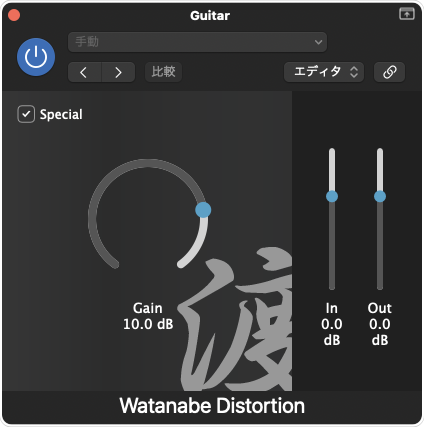
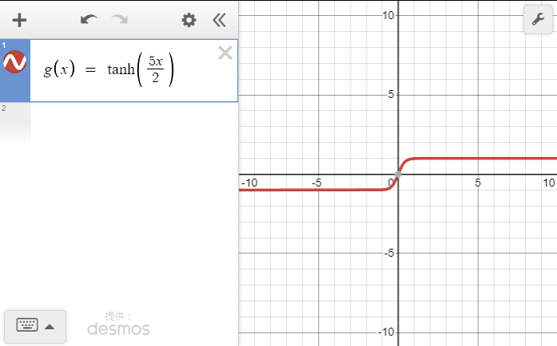

# 渡邉ディストーション
* オリジナルのDTM用ディストーションプラグインです。
* 「Gain」で歪み量を調整、「Special」をONにすると歪み方が変化(ブースト)します。


## 実装内容

* メインの処理は<a href="Source/PluginProcessor.cpp">Source/PluginProcessor.cpp</a>の<code>processBlock</code>関数に記載してあります。
* 通常の歪みは、シンプルに指定値をthreshold値としてフィルタしています。
  ```
  // gain to threshold.
  auto gainDecibel = juce::Decibels::gainToDecibels(pow(getParameter(Gain), 2));
  auto threshold = juce::Decibels::decibelsToGain(gainDecibel * -1.0);
  
  // apply distortion.
  for (auto channel = 0; channel < totalNumInputChannels; ++channel)
  {
      auto* channelData = buffer.getWritePointer (channel);
      for (auto buffNum = 0; buffNum < buffer.getNumSamples(); buffNum++)
      {
          // special effect.
  
  ・・・
  
          // clipping by threshold.
          if (channelData[buffNum] >= threshold)
          {
              channelData[buffNum] = threshold;
          }
          else if (channelData[buffNum] <= -threshold)
          {
              channelData[buffNum] = -threshold;
          }
          channelData[buffNum] *= (1 / threshold);
      }
  }
  ```
* 「Special」チェックボックスをONにした場合には、$`g(x)=\tanh{\frac{5x}{2}}`$関数を使用して制御します。
    ```
    // special effect.
    if (getParameter(Special) == 1.0f)
    {
        channelData[buffNum] *= (gainDecibel/2.0);
        channelData[buffNum] = tanh(5.0 * channelData[buffNum] / 2);
        continue;
    }
    ```
  * 通常よりも強く歪み、ハイゲイン風のエフェクトになります。

